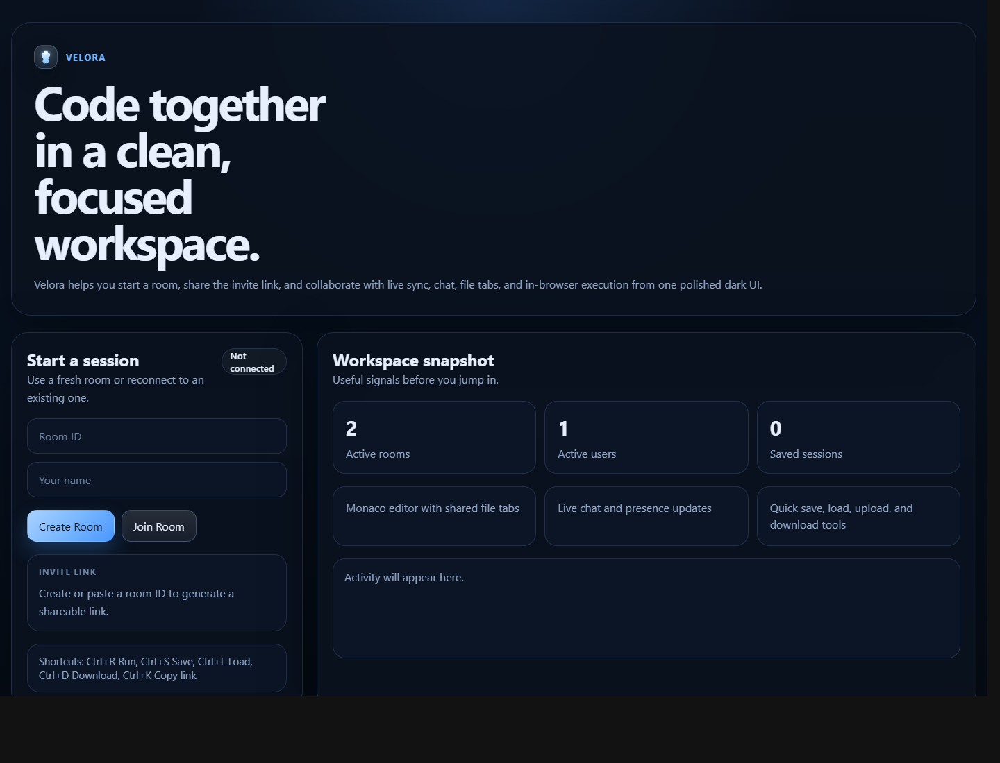
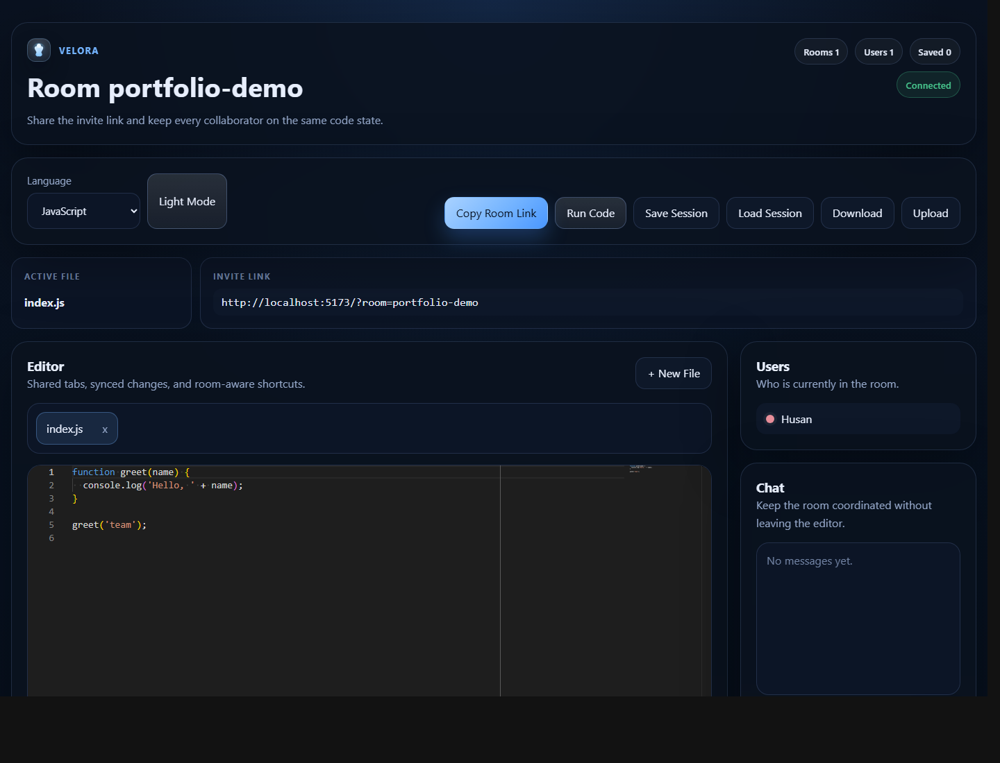
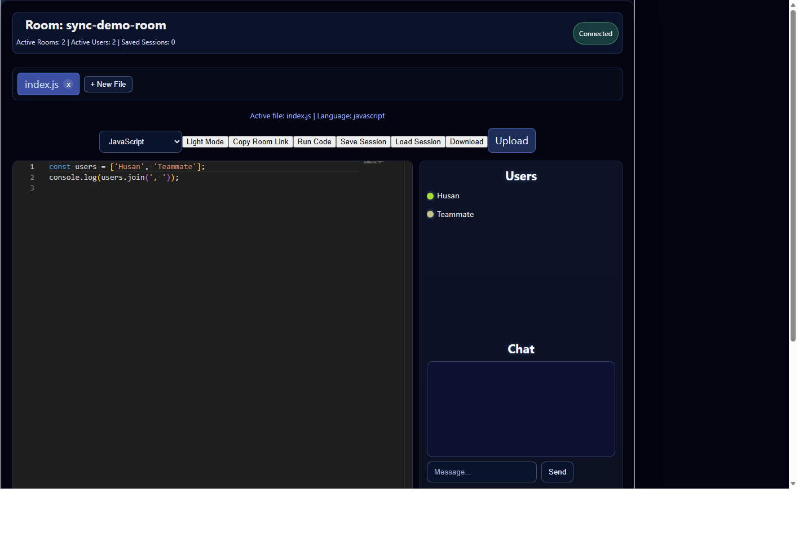

# Realtime Collaborative Code Editor

Realtime collaborative code editor with shared rooms, live syncing, Socket.io-powered collaboration, and in-browser code execution.

## Features

- Create and join collaborative rooms
- Realtime code sync between users
- Active user list and join/leave updates
- Monaco editor integration
- Basic remote cursor sharing
- Room chat
- Copyable room invite link
- Run JavaScript / TypeScript snippets
- Save and reload sessions in memory
- Download and upload code files
- Light and dark themes

## Tech Stack

- React
- Vite
- Node.js
- Express
- Socket.io
- Monaco Editor

## Folder Structure

```text
code_editor/
|-- client/
|   |-- src/
|   |-- public/
|   |-- .env.example
|   `-- package.json
|-- server/
|   |-- index.js
|   |-- server.test.js
|   |-- .env.example
|   `-- package.json
|-- docs/
|   `-- screenshots/
|-- render.yaml
`-- README.md
```

## Run Locally

### 1. Install dependencies

```bash
cd client
npm install
cd ..
cd server
npm install
cd ..
```

### 2. Start the server

```bash
cd server
npm start
```

The backend runs on `http://localhost:4000`.

### 3. Start the frontend

In a second terminal:

```bash
cd client
npm run dev
```

The frontend runs on `http://localhost:5173`.

## Architecture

- The React client connects to the Node.js backend through Socket.io for room join, code updates, cursor sharing, and chat events.
- The Express server keeps each room in memory with its files, connected users, and chat messages.
- Realtime changes are emitted to the current room so other connected clients stay in sync without page refreshes.
- REST endpoints handle health checks, code execution, room stats, and session save/load behavior.

## Deployment

### Frontend on Vercel

1. Import this repository into Vercel.
2. Set the root directory to `client`.
3. Build command: `npm run build`
4. Output directory: `dist`
5. Environment variable: `VITE_BACKEND_URL=https://your-render-service.onrender.com`

### Backend on Render

1. Create a new Web Service from this repository.
2. Set the root directory to `server`.
3. Build command: `npm install`
4. Start command: `npm start`
5. Environment variable: `CLIENT_ORIGIN=https://your-app.vercel.app`

The included [`render.yaml`](./render.yaml) can help bootstrap the backend service configuration.

## Testing

Run the backend smoke test:

```bash
cd server
npm test
```

Run frontend lint:

```bash
cd client
npm run lint
```

Create a production build:

```bash
cd client
npm run build
```

## Screenshots

### Join Room



### Editor



### Sync Demo



## Demo

- Live Demo: `https://your-app.vercel.app`
- Demo Video / GIF: add a short Loom, LinkedIn post, or GIF here
- Local demo: `http://localhost:5173`

## Challenges Faced

- Keeping realtime code updates responsive without losing the active file state between clients.
- Tracking remote cursor presence clearly with Monaco decorations.
- Managing room lifecycle and multi-user state with in-memory storage.
- Balancing code execution convenience with basic sandbox safety.

## Future Improvements

- Deploy client and server
- Add persistent storage for rooms and sessions
- Add authentication and room ownership
- Improve editor sandboxing for code execution
- Add richer presence indicators and typing state
- Record and attach a short demo video
