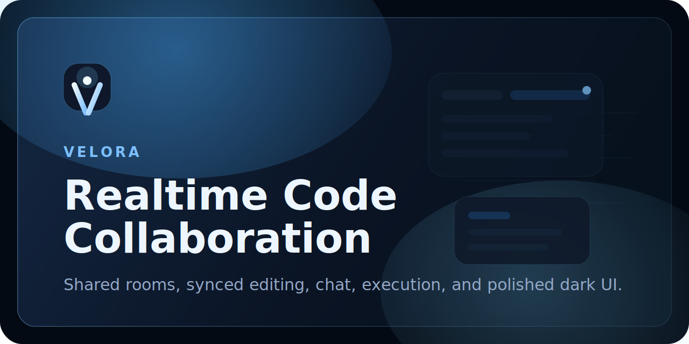

# Velora

<p align="center">
  
</p>

Velora is a full-stack collaborative coding workspace with shared rooms, live synchronization, Monaco Editor, chat, session persistence, and in-browser code execution.

<p align="center">
  <strong>Realtime collaboration</strong> &bull; <strong>Shared file tabs</strong> &bull; <strong>Built-in code execution</strong>
</p>

## Live Demo

- Frontend: https://code-editor-2kz5h1y4d-husan6s-projects.vercel.app
- Backend API: https://code-editor-fg9e.onrender.com

## Screenshots

<p align="center">
  
  
  
</p>

## Features

- Create a room instantly and share it with a copyable invite link
- Edit code together in real time with Socket.io-powered synchronization
- Work inside Monaco Editor with multi-file tabs and language switching
- See active collaborators and room presence updates live
- Use built-in room chat while coding
- Run JavaScript and TypeScript snippets from the editor
- Save and reload room sessions
- Upload local files or download the current file quickly
- Restore local room backups from `localStorage`
- Use a polished responsive UI with dark theme support

## Tech Stack

- React
- Vite
- Node.js
- Express
- Socket.io
- Monaco Editor

## Project Structure

```text
code_editor/
|-- client/
|   |-- src/
|   |-- public/
|   |-- .env.example
|   `-- package.json
|-- server/
|   |-- index.js
|   |-- server.test.js
|   |-- .env.example
|   `-- package.json
|-- docs/
|   |-- branding/
|   `-- screenshots/
|-- render.yaml
`-- README.md
```

## Run Locally

### 1. Install dependencies

```bash
cd client
npm install
cd ../server
npm install
```

### 2. Start the backend

```bash
cd server
npm start
```

The backend runs on `http://localhost:4000`.

### 3. Start the frontend

```bash
cd client
npm run dev
```

The frontend runs on `http://localhost:5173`.

## How It Works

- The React client joins rooms and syncs events through Socket.io.
- The Node.js and Express backend manages rooms, users, messages, and shared files in memory.
- Editor changes, chat updates, and presence signals are broadcast to everyone in the same room.
- REST endpoints handle execution, room stats, and save/load session flows.

## Deployment

### Frontend on Vercel

1. Import this repository into Vercel.
2. Set the root directory to `client`.
3. Use `npm run build` as the build command.
4. Use `dist` as the output directory.
5. Add `VITE_BACKEND_URL=https://your-render-service.onrender.com`.

### Backend on Render

1. Create a new Web Service from this repository.
2. Set the root directory to `server`.
3. Use `npm install` as the build command.
4. Use `npm start` as the start command.
5. Add `CLIENT_ORIGIN=https://your-app.vercel.app`.

The included [`render.yaml`](./render.yaml) can help bootstrap the backend service configuration.

## Testing

```bash
cd server
npm test
```

```bash
cd client
npm run lint
```

```bash
cd client
npm run build
```

## Future Improvements

- Add persistent database-backed room storage
- Add authentication and room ownership controls
- Improve code execution sandboxing
- Add richer collaborator indicators and cursor metadata
- Record a short product demo video or GIF for the README
